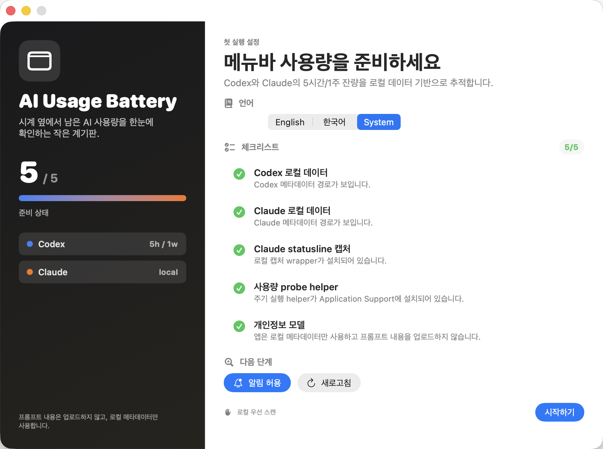
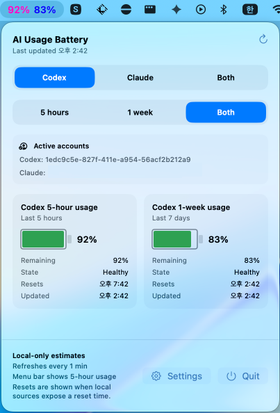
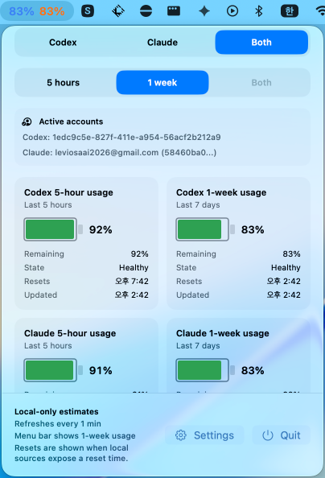
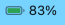
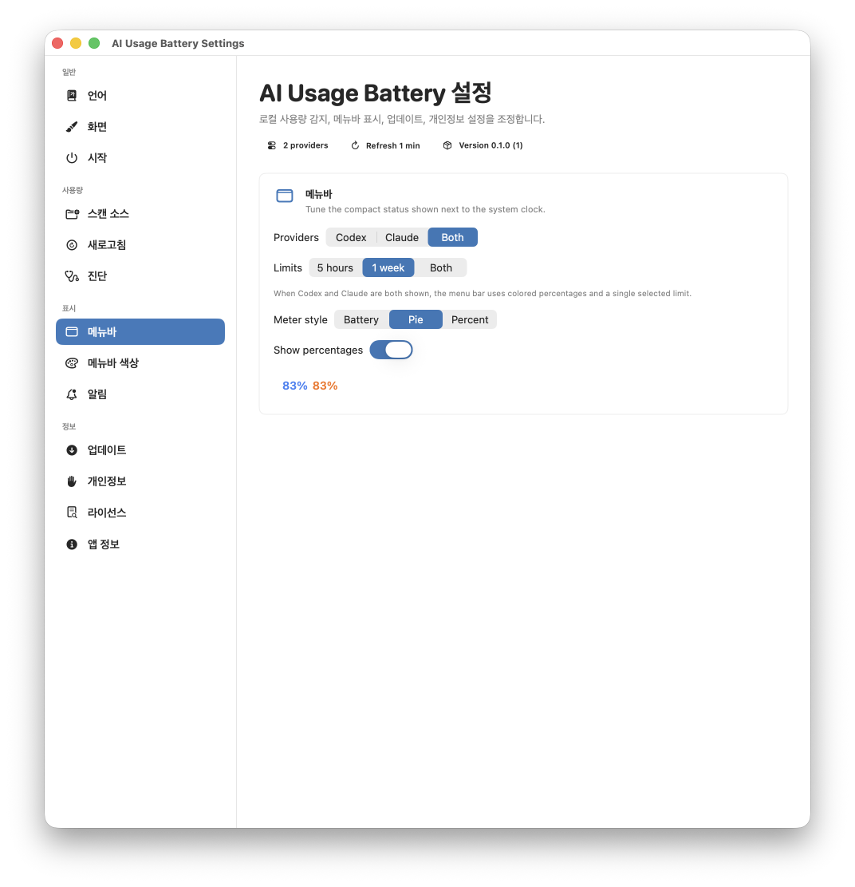
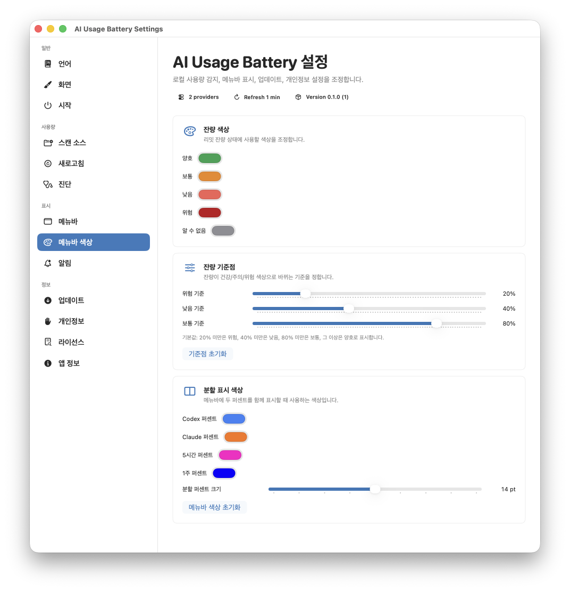
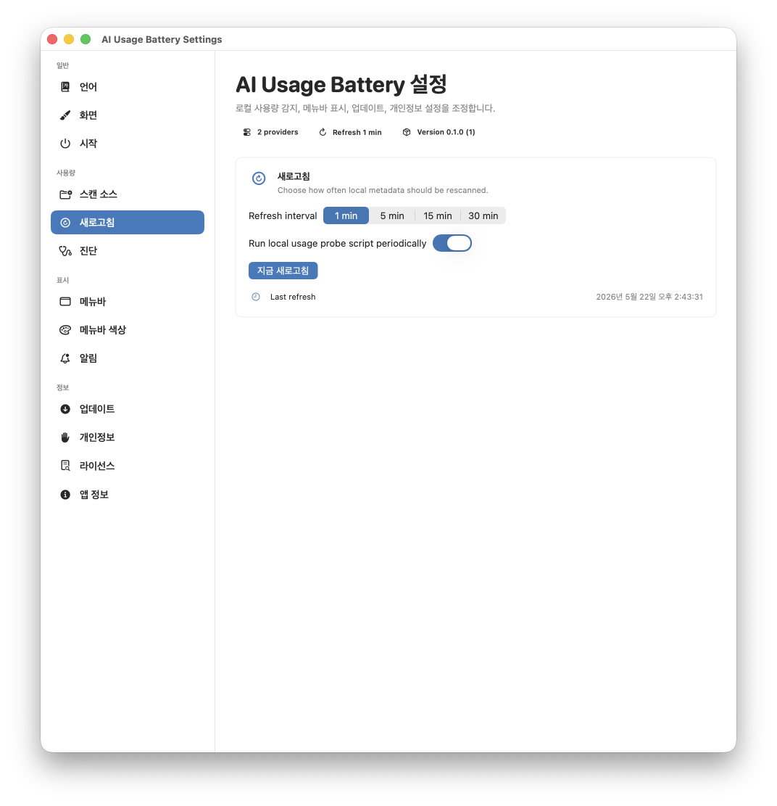
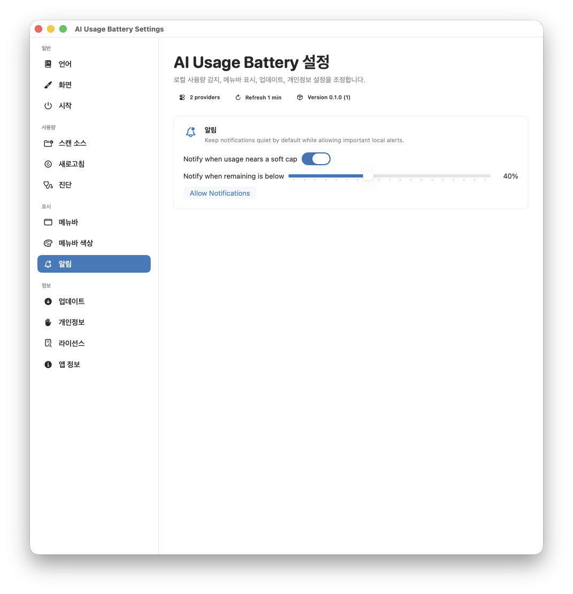

# AI Usage Battery

[English](#english) | [한국어](#한국어)

## English

AI Usage Battery is a local-first macOS menu bar app for tracking Codex and Claude usage limits. It estimates remaining usage from local metadata and status information, then keeps the result visible beside the system clock. Prompt content and provider credentials are not uploaded.

| First-run setup |
| --- |
|  |

### What It Shows

- Codex and Claude usage in one menu bar app.
- 5-hour and 1-week usage windows.
- Remaining percentage, reset time when available, and latest local refresh status.
- Codex-only, Claude-only, dual-provider, and dual-window display modes.
- A first-run checklist for local data readiness, Claude statusline capture, usage probe setup, and privacy expectations.

### Menu Bar Modes

Show one provider, both providers, one limit window, or both limit windows depending on how you work.

| Codex with both limits | Both providers with one limit |
| --- | --- |
|  |  |

Compact menu bar meters can use a battery-style indicator, a pie-style indicator, or percentages.

| Battery | Pie |
| --- | --- |
|  |  |

### Customization

The Settings window lets you tune both behavior and appearance:

- Choose whether the menu bar shows Codex, Claude, or both.
- Choose whether it shows the 5-hour limit, 1-week limit, or both windows.
- Pick battery, pie, or percentage display styles.
- Customize remaining-limit colors for healthy, medium, low, critical, and unknown states.
- Customize split percentage colors for Codex vs Claude and 5-hour vs 1-week displays.
- Adjust the split percentage font size.
- Set custom threshold percentages instead of using fixed 20/40/80 cutoffs.
- Configure refresh cadence and whether the bundled usage probe helper runs periodically.
- Configure local notifications for near-limit alerts.

| Menu bar settings | Color and threshold settings |
| --- | --- |
|  |  |

| Refresh settings | Notification settings |
| --- | --- |
|  |  |

### Download

Download the latest DMG from the [GitHub Releases page](https://github.com/Dindb-dong/AIUsageBattery_Releases/releases/latest).

---

## 한국어

AI Usage Battery는 Codex와 Claude의 사용량 리밋을 메뉴바에서 확인할 수 있는 로컬 우선 macOS 앱입니다. 로컬 메타데이터와 상태 정보를 기반으로 남은 사용량을 추정하며, 프롬프트 내용이나 제공자 계정 정보는 업로드하지 않습니다.

| 첫 실행 설정 |
| --- |
|  |

### 제공 기능

- 하나의 메뉴바 앱에서 Codex와 Claude 사용량 확인.
- 5시간 리밋과 1주 리밋 표시.
- 남은 퍼센트, 가능한 경우 리셋 시간, 마지막 로컬 갱신 상태 표시.
- Codex만, Claude만, 둘 다, 5시간/1주 동시 표시 모드 지원.
- 로컬 데이터, Claude statusline 캡처, probe helper, 개인정보 모델을 확인하는 첫 실행 체크리스트.

### 메뉴바 표시 모드

작업 방식에 맞게 하나의 제공자만 보거나, Codex와 Claude를 함께 보거나, 하나의 리밋 또는 두 리밋을 함께 볼 수 있습니다.

| Codex + 두 리밋 | Codex/Claude + 1주 리밋 |
| --- | --- |
|  |  |

메뉴바의 작은 미터는 배터리, 파이, 퍼센트 스타일로 표시할 수 있습니다.

| 배터리 | 파이 |
| --- | --- |
|  |  |

### 커스터마이징

설정 창에서 표시 방식과 동작을 세밀하게 조정할 수 있습니다:

- 메뉴바에 Codex, Claude, 또는 둘 다 표시.
- 5시간 리밋, 1주 리밋, 또는 두 리밋 동시 표시.
- 배터리, 파이, 퍼센트 표시 스타일 선택.
- 잔량 상태별 색상 직접 지정: 양호, 보통, 낮음, 위험, 알 수 없음.
- Codex/Claude 분할 퍼센트와 5시간/1주 분할 퍼센트 색상 지정.
- 분할 퍼센트 텍스트 크기 조정.
- 하드코딩된 20/40/80 기준 대신 사용자가 직접 잔량 기준점 설정.
- 로컬 메타데이터 갱신 주기와 번들 probe helper 주기 실행 설정.
- 리밋 근접 알림 설정.

| 메뉴바 설정 | 색상과 기준점 설정 |
| --- | --- |
|  |  |

| 갱신 설정 | 알림 설정 |
| --- | --- |
|  |  |

### 다운로드

최신 DMG는 [GitHub Releases 페이지](https://github.com/Dindb-dong/AIUsageBattery_Releases/releases/latest)에서 받을 수 있습니다.
